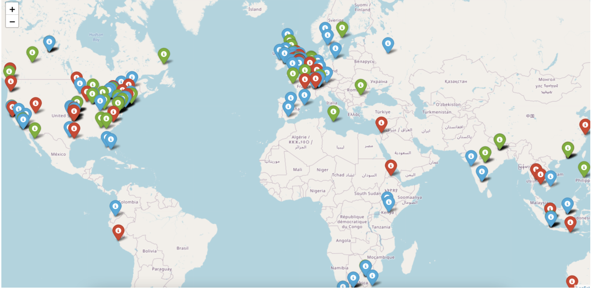

# sentimental
Fintech Project 2 - Analysis Of Crypto Pricing and Ukraine War Twitter Sentiment  

## Project Overview
An analysis of Twitter Data based on Ukraine and crypto queries. This data was cleaned, and then run through sentiment analysis, looking for relationships between crypto prices and twitter sentiment on war/query topics.  

[Presentation slides](/media/presentation.pdf)  

See [installation guide](#installation-guide) below for specifics on setting up your environment.

---

## Technologies And Modules

This proect uses [python 3.7](https://docs.python.org/3.7/) and the following modules:  

[Built-in](https://docs.python.org/3/py-modindex.html) modules:  
- [time](https://docs.python.org/3.7/library/time.html?highlight=time#module-time)
- [datetime](https://docs.python.org/3.7/library/datetime.html#module-datetime)
- [re](https://docs.python.org/3.7/library/re.html?highlight=re#module-re)

From [pip](https://pypi.org/):  
- [pandas](https://pypi.org/project/pandas/)
- [numpy](https://pypi.org/project/numpy/)


See [installation guide](#installation-guide) below for specifics on setting up your environment.

---


## Installation Guide

**NOTE** Twitter API Usage  
You must sign up for a Twitter API key in order to authenticate and fetch twitter data.  

You will need Python 3.7 for this application to run. An easy way to install python 3.7 is to download and install [Anaconda](https://www.anaconda.com/products/individual). After installing anaconda, open a terminal/command-prompt, and setup a python 3.7 environment, and then activate it like so:

```
# creating a python 3.7 environment
# name can be any friendly name to refer to your environment, eg 'dev'
conda create --name dev python=3.7 anaconda

# activating the environment
conda activate dev
```

Next, use [pip](https://pypi.org/project/pip/) to install the required modules from the [list above](#Technologies-And-Modules)


```
# instaling required modules
$ pip install pandas
$ etc...
```
You are now ready to run the program!

---

## Usage

First, ensure you've cloned this repo and setup your environment as detailed in the [Installation Guide](#installation-guide)

### Main application


#### Twitter API Usage Notes

TBD  

---


## Analysis





### Assumptions

TBD  

### Summary

TBD  

---


## Contributors

[Peter Morales](https://github.com/pmm09c)  
[Shivangi Gupta](https://github.com/shivangiuw)   
[Jaime Aranda](https://github.com/Aranda80)  
[David Lopez](https://github.com/sububer)  

---

## License

MIT